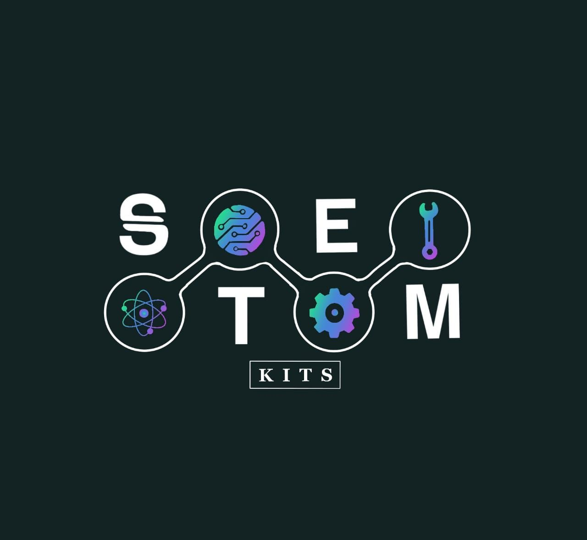

# StemKits
### Scientific learning, made more accessible.   

## About Us

STEM Kits are ready-made, comprehensive kits that can be purchased online. Each kit consists of several experiments that can be performed either by an individual, or in groups. The kits can be purchased off of the website, or requested for pickup from specific locations across Lahore. 

## Our Mission

The thought process that went behind STEM Kits come as an outcome of a lack of readily available science experiments in countries like Pakistan. Countries with immense untouched talent but with no facilities to nurture it. STEM Kits hopes to make scientific learning inexpensive, innovative and available to all, one kit at a time. 

## Community Outreach 

With the goal of making kits more accessible, the STEM Kits team plans to donate all profits made off the Kits for constructing similar models for the underprivileged communities, teaching the basics of various scientific concepts to those deprived of such resources. 

## S.T.E.M Kit 1 

### Experiments:

Non-Newtonian Fluids  
Elephant's Toothpaste 
Lava Lamp

### Component:

Hydrogen peroxide 
Liquid dishwashing soap
Dry yeast 
Cornstarch 
Vegetable Oil 
Baking Soda 
Vinegar

## S.T.E.M Kit 2

### Projects: 
Obstacle avoiding Car
Temperature sensor
Password secured lock 

### Components:

Arduino UNO
Ultrasonic sensor
Geared motors
Jumper wires 
Infrared receiver and remote
Thermistors and LDR
